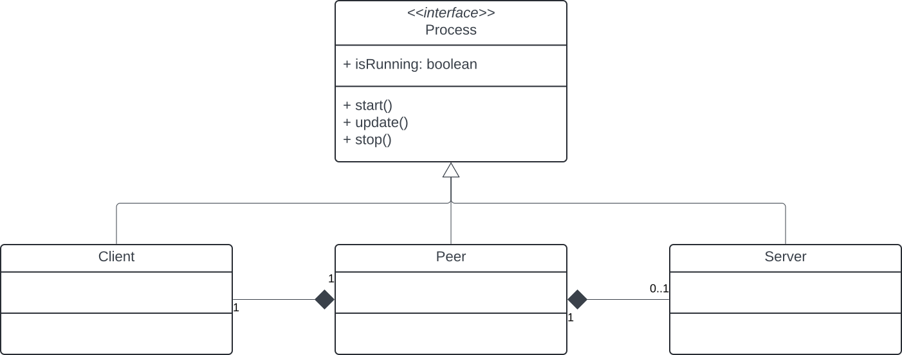

# kotlin-tcp-group-chat

This directory contains the solution to the TCP Group Chat Exercise, written from scratch in Kotlin (Kotlin/JVM) with the help of the [Ktor](https://ktor.io) networking library (from which only *raw sockets* were used, to stay on par with the Python examples provided).  
The project also takes heavy advantage of [Coroutines](https://kotlinlang.org/docs/coroutines-overview.html), a modern Kotlin technology that replaces multithreaded programming.

## Architecture

The program adopts a hybrid mix of client-server and p2p, called [*leader/follower* pattern](https://www.geeksforgeeks.org/leader-follower-pattern-in-distributed-systems/).

The main idea is integrating the server into one of the clients, which acts as a leader. In the implementation, the leader client is the first to connect to the server: at that point, since the server does not exist yet and the connection will be refused, said client creates a new server at the same address he attempted connecting at, and retries the connection. Each client that joins later will be a follower.

Clients and server exchange events through a simple protocol. The server also keeps track of online clients.

**Pro:** more flexible than standard client-server architecture, and does not require storing each peer's address.  
**Con:** the server stops if the leader leaves the server. It could however be possible to move all the data to another client and transfer leadership on the fly (not implemented).

### Protocol

Each client is assigned a unique 36-bytes ID.

Every message exchanged between clients and server is text-based and consists of a 37-byte header:
1. The first byte is a single digit that describes the event type: `0` for text messages, `1` for a new connection (join), `2` for a disconnection (quit).
2. The next 36 bytes store the client's UUID.
3. The remaining string is the content of the message.

1. When a client connects, it sends a join event and shares its name (set by the user) as the message content.
2. When the server receives this event, it associates the client's UUID (contained in the header) to its name into a lookup table.
3. When any event is notified by the client to the server, the server bounces it back to all the clients (broadcast), also attaching the name of the responsible client (stored in the table).

### Implementation

In my implementation, `Client` and `Server` classes have distinct roles and responsibilities. They are however brought together by a `Peer`, which always wraps a `Client` and, optionally if it's the leader, a `Server` instance.  
Plain client and server instances can be created via a `ProcessFactory` which decorates both thanks to the observer pattern in order to react to events via a callback.



## Running

Java 17+ is required. In order to launch a peer, the following command can be executed, where the content of `args` can be changed to any address.

```
./gradlew run --console=plain --args="127.0.0.1:9002" 
```

Example:

```
[412a2834-48c3-4dd1-98cf-2ad4b5cc2943] client0 has joined the chat. Now online: [client0]
[c0104bb7-36f0-47fc-a7ad-425f38543063] client1 has joined the chat. Now online: [client0, client1]
[412a2834-48c3-4dd1-98cf-2ad4b5cc2943] client0: I'm client0
[37c591bc-2dc6-4b2e-8969-f8dbc01c58bb] client2 has joined the chat. Now online: [client0, client1, client2]
[c0104bb7-36f0-47fc-a7ad-425f38543063] client1: I'm client1
[412a2834-48c3-4dd1-98cf-2ad4b5cc2943] client0: I'm client0 again
[cccda099-182d-405f-9ff6-7a00fc7a74e1] client3 has joined the chat. Now online: [client0, client1, client2, client3]
[37c591bc-2dc6-4b2e-8969-f8dbc01c58bb] client2: I'm client2
[c0104bb7-36f0-47fc-a7ad-425f38543063] client1: I'm client1 again
[cccda099-182d-405f-9ff6-7a00fc7a74e1] client3: I'm client3
[37c591bc-2dc6-4b2e-8969-f8dbc01c58bb] client2: I'm client2 again
[cccda099-182d-405f-9ff6-7a00fc7a74e1] client3: I'm client3 again
[cccda099-182d-405f-9ff6-7a00fc7a74e1] client3: Leaving!
[cccda099-182d-405f-9ff6-7a00fc7a74e1] client3 has left the chat. Now online: [client0, client1, client2]
[37c591bc-2dc6-4b2e-8969-f8dbc01c58bb] client2: Leaving!
[37c591bc-2dc6-4b2e-8969-f8dbc01c58bb] client2 has left the chat. Now online: [client0, client1]
[c0104bb7-36f0-47fc-a7ad-425f38543063] client1: Leaving!
[c0104bb7-36f0-47fc-a7ad-425f38543063] client1 has left the chat. Now online: [client0]
[412a2834-48c3-4dd1-98cf-2ad4b5cc2943] client0: Leaving!
[412a2834-48c3-4dd1-98cf-2ad4b5cc2943] client0 has left the chat. Now online: []
```

## Tests

Unit tests simulate the previous example chat between 4 peers. Each received message is stored in a log string which is then checked after 15 seconds since the execution started.

The test can be launched via `./gradlew test`.

Please note that the delays in the tests were manually fine-tuned and could lead to failure under different network speeds and systems. I run and test on macOS.